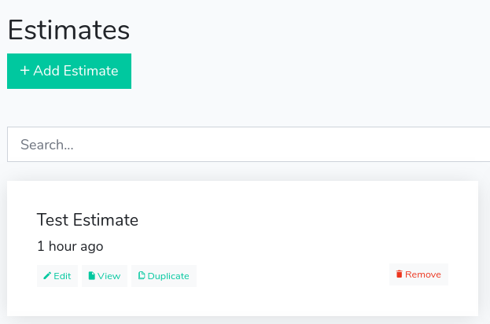
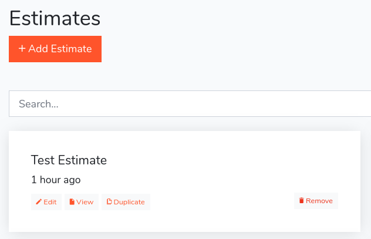

# Changing the Colors

All the LaraEstimate styles are in the **resources/assets/sass** folder and are compiled with [Laravel Mix](MIX.md). First, you need to start the [Laravel Mix](MIX.md), as we teach in the [Building Assets with Mix](MIX.md) section. Let's learn how to modify some visual parts of the system.

## 1. Change the brand primary color
As you can see in this dashboard, the primary color of the system is turquoise that is a variation of green:



Now, open the **resources/assets/sass/_variables.scss** file and locate this line:

```
$primary: $turquoise !default;
```

And change it to:

```
$primary: #ff6348 !default;
```
And now, after running the Mix compilation (with **npm run dev** or **npm run watch**), the primary color of the system is orange:



As you can see it is very simple to modify the system appearance, simply changing the SASS variables. We encourage you to navigate in the SASS files and stylize the system as you like.