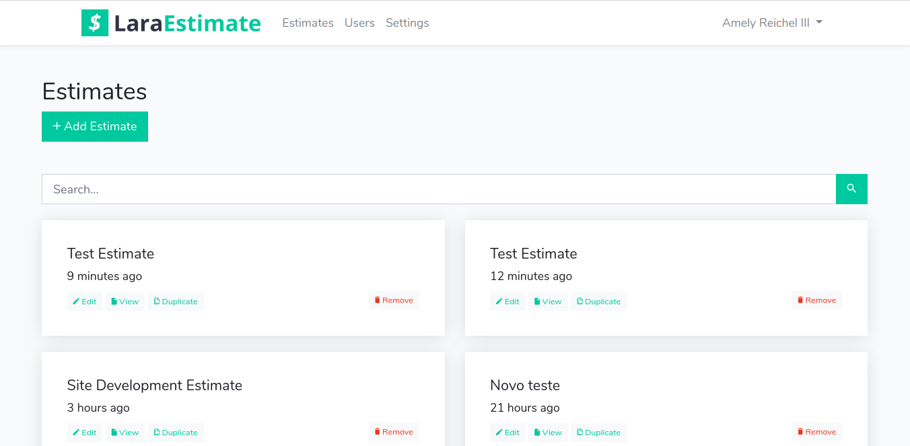
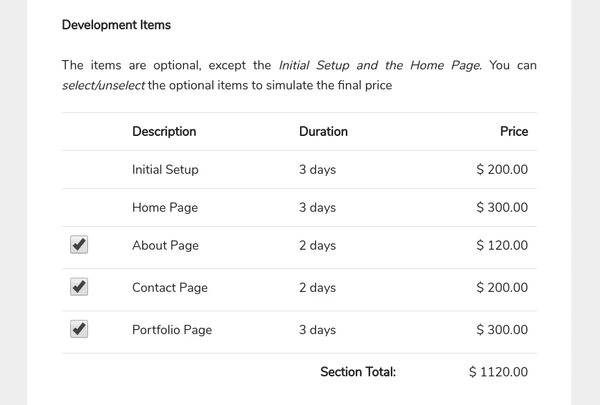

# Introduction

**LaraEstimate** is a complete *Estimate System* made with **Laravel 7 and VueJS**. 

The system has the following features:

- Allows to create Estimates with Dynamic Pricing (so your customer can simulate the total price selecting/unselecting items)
- Allows sending Estimates links
- Allows sending Estimates to E-mail
- Allows printing Estimates
- Allows multiple text and price sections on Estimate (with Dynamic Price or not)
- Allows duplicating Estimates for rapid creation
- Allows changing the Estimate Currency, Decimal Separator, and Thousands Separator
- Allows translating to other languages using [Laravel Localization System](https://laravel.com/docs/7.x/localization)

If you want, you can see a live preview here: [Live Preview - LaraEstimate](https://laravel.com/docs/7.x/localization)

LaraEstimate has an intuitive and beautiful interface for creating and presenting estimates...

